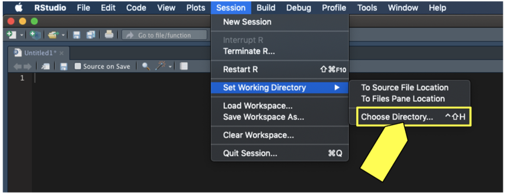
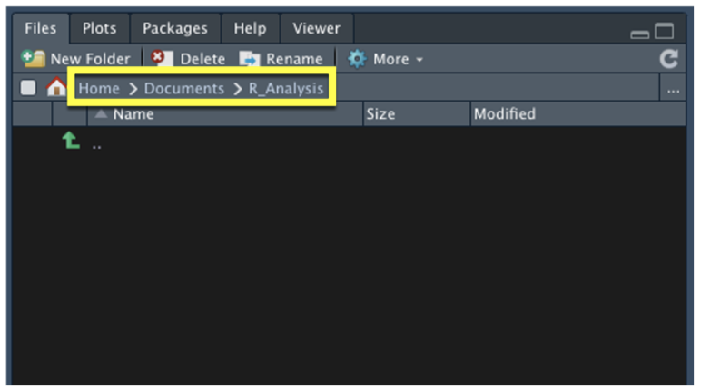
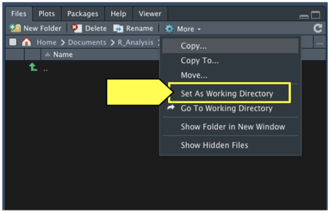
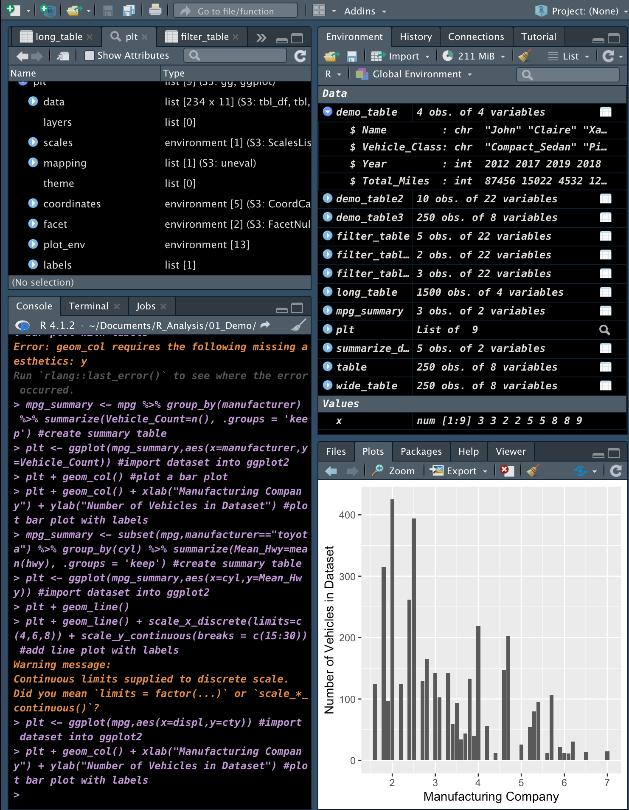
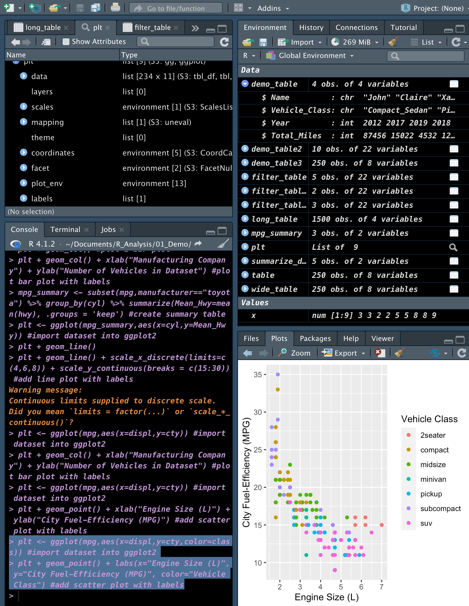
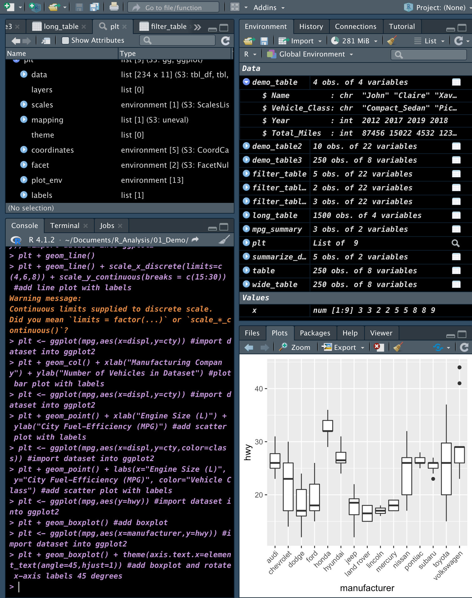
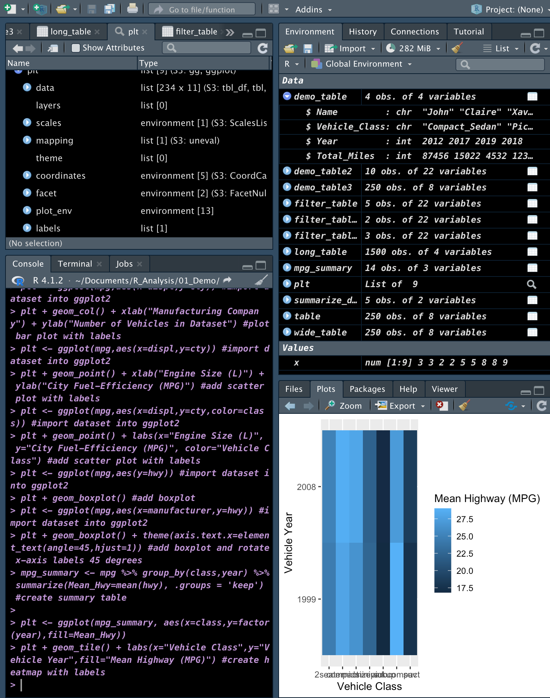
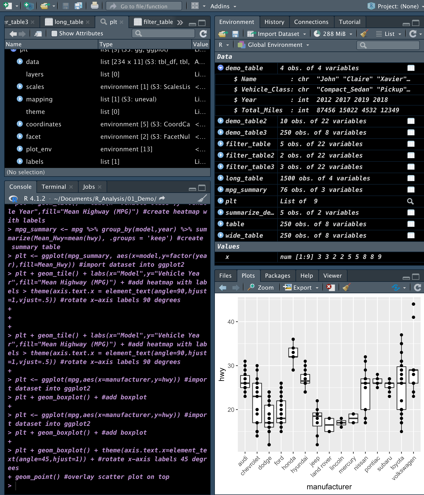
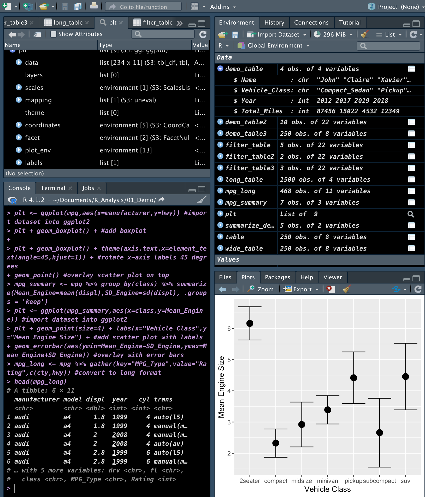
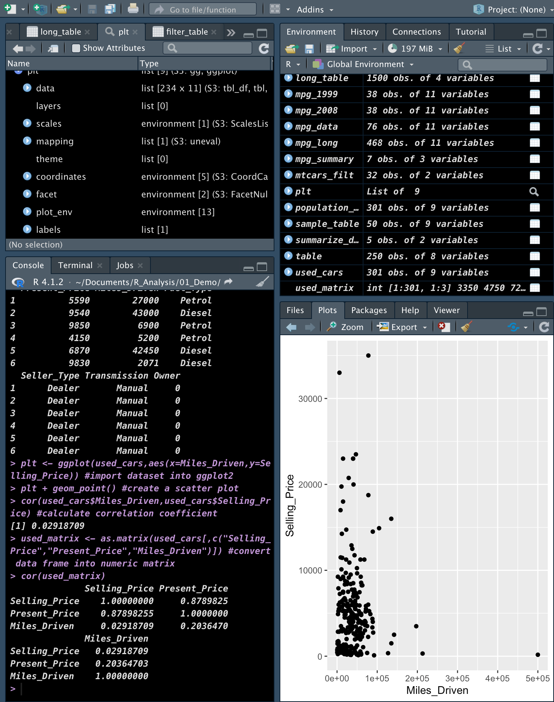

# **RStudio**

For any project it is important to set a Working Directory. Here are the steps:
1. In the R menu screen, go to Session, click Set Working Directory, then select Choose Directory.



2. Navigate to the folder on your computer and select Open. If you click on the Files tab in your bottom-right multi-tool pane, notice that the folder now represents your active working directory:



3. create a new folder in your active directory using the "New Folder" button. For the purposes of this first section of the module, let's name this new folder "01_Demo." Once you have created the folder, press the refresh ( ) button to refresh the directory to see your new folder.



# **Installations and Utilities:**

## **Install RStudio**
### ***Web Sources***

[R's Comprehensive R Archive Network (CRAN) server](https://cran.r-project.org/mirrors.html)
[RStudio Download Page](https://www.rstudio.com/products/rstudio/download/?utm_source=downloadrstudio&utm_medium=Site&utm_campaign=home-hero-cta#download)
[R Introduction documentation](https://cran.r-project.org/doc/manuals/r-release/R-intro.pdf)

```
> The dplyr library contains a wide variety of functions that can be chained together to transform data quickly and easily. Using dplyr is slightly more complex than the simple assignment statement in R because dplyr allows the user to chain together functions in a single statement using their own pipe operator `(%>%)`.
- Washington University of Saint Louise
```

### ***R Packages for data science***

`install.packages("tidyverse")`
`install.packages("jsonlite")`

### ***R Documentation***

[Tidyverse's dplyr](https://dplyr.tidyverse.org/)
[R's ggplot2](https://ggplot2.tidyverse.org/reference/index.html)
[R's ggplot2](https://ggplot2.tidyverse.org/reference/index.html)
[Customizable in ggplot2](http://www.cookbook-r.com/Graphs/Axes_(ggplot2)/)
[Customizable geo_point](https://ggplot2.tidyverse.org/reference/geom_point.html#aesthetics)

### ***R Libraries***

`library(jsonlite)`
`library(tidyverse)`: The tidyverse package contains libraries such as dplyr, tidyr, and ggplot2.

## **R Commands**
### ***Important Commands***

`setwd("Folder_name")`: This helps to locate in the folder is needed.
`read.csv()`: This function raeds comma-separated values (CSV).
`read.delim()`: This helps for tab-delimited files.
`read.table()`: THis helps to manually tell the function what delimiter is used.
`subset()`: Function that uses a few arguments to subset and filter a two-dimensional R data structure.
Arguments:
- x: is the matrix, data frame, or tibble we wish to subset.
- subset: contains the logical statements that determine which rows to keep.
- select: contains a logical statement, or list of column names to select from a data frame. If nothing is supplied, all columns will be returned.

`sample()`: Function uses a few arguments to create a sampled vector from a larger vector.
Arguments:
- x: is the larger vector to select from.
- size: is the number of sample data points to select from x.
- replace: is a flag to tell whether or not it is okay to select the same values. By default, the argument is set to FALSE, which means each selected value is unique.

`mutate()`: Transforms a data frame and include new calculated data columns.
`group_by()`: This function tells dplyr which factor (or list of factors in order) to group our data frame by.
`summarize()`: Example: summarize_demo <- demo_table2 %>% group_by(condition) %>% summarize(Mean_Mileage=mean(odometer), .groups = 'keep') #create summary table
 ```
 The summarize() function takes an additional argument, .groups. This allows you to control the the grouping of the result. The four possible values are:

.groups = "drop_last" drops the last grouping level (default)
.groups = "drop" drops all grouping levels and returns a tibble
.groups = "keep" preserves the grouping of the input
.groups = "rowwise" turns each row into its own group
```
```
 Statistics summary functions: `mean()`; `median()`; `sd()`; `min()`; `max()`; `n()`.
```
`gather()`: This function is used to transform a wide dataset into a long dataset.
Arguments:
- data: is the data frame we wish to reshape. Instead of supplying the data frame object, we can alternatively use the pipe operator to create a dplyr/tidyr all-in-one statement.
- key:  is the name of the variable column that we wish to spread out.
- value: is the name of the value column that we wish to fill in our new variable columns with.
- fill: is an optional argument that will set any empty rows in a new variable column with the fill value.

`pivot_longer()` or `pivot_wider()`: The data by increasing the number rows and decreasing the number of columns.
`all.equal()`: If you ever compare two data frames that you expect to be equal.
`ggplot()`: Function only requires two arguments to declare the input data. Needs two arguments: data and mapping
Arguments:
- data: is our input data frame.
- mapping: uses the `aes()` aesthetic function to tell `ggplot()` what variables are assigned to the x (independent) and y (dependent) variables.
```
Example:
> plt <- ggplot(mpg,aes(x=class)) #import dataset into ggplot2
> plt + geom_bar() #plot a bar plot
> plt + geom_col() + xlab("Manufacturing Company") + ylab("Number of Vehicles in Dataset") #plot bar plot with labels

```
`xlab()` and `ylab()`: To change the titles of our x-axis and y-axis.
`element_text()`: Function to 45 degrees and our `hjust` argument to 1. The `hjust` argument tells ggplot that our rotated labels should be aligned horizontally to our tick marks.


```
Example 2:
> mpg_summary <- subset(mpg,manufacturer=="toyota") %>% group_by(cyl) %>% summarize(Mean_Hwy=mean(hwy), .groups = 'keep') #create summary table
> plt <- ggplot(mpg_summary,aes(x=cyl,y=Mean_Hwy)) #import dataset into ggplot2
> plt + geom_line()
> plt + geom_line() + scale_x_discrete(limits=c(4,6,8)) + scale_y_continuous(breaks = c(15:30)) #add line plot with labels
or
> plt <- ggplot(mpg,aes(x=displ,y=cty,color=class)) #import dataset into ggplot2
> plt + geom_point() + labs(x="Engine Size (L)", y="City Fuel-Efficiency (MPG)", color="Vehicle Class") #add scatter plot with labels
```
`scale_x_discrete()` and `scale_y_continuous()`


```
Example 3:
> plt <- ggplot(mpg,aes(y=hwy)) #import dataset into ggplot2
> plt + geom_boxplot() #add boxplot
or
> plt <- ggplot(mpg,aes(x=manufacturer,y=hwy)) #import dataset into ggplot2
> plt + geom_boxplot() + theme(axis.text.x=element_text(angle=45,hjust=1)) #add boxplot and rotate x-axis labels 45 degrees
```



```
Example 4:
> mpg_summary <- mpg %>% group_by(class,year) %>% summarize(Mean_Hwy=mean(hwy), .groups = 'keep') #create summary table
> plt <- ggplot(mpg_summary, aes(x=class,y=factor(year),fill=Mean_Hwy))
> plt + geom_tile() + labs(x="Vehicle Class",y="Vehicle Year",fill="Mean Highway (MPG)") #create heatmap with labels
```


```
Example 5:
> plt <- ggplot(mpg,aes(x=manufacturer,y=hwy)) #import dataset into ggplot2
> plt + geom_boxplot() + #add boxplot
> theme(axis.text.x=element_text(angle=45,hjust=1)) + #rotate x-axis labels 45 degrees
> geom_point() #overlay scatter plot on top
```


```
Example 6:
> mpg_summary <- mpg %>% group_by(class) %>% summarize(Mean_Engine=mean(displ),SD_Engine=sd(displ), .groups = 'keep')
> plt <- ggplot(mpg_summary,aes(x=class,y=Mean_Engine)) #import dataset into ggplot2
> plt + geom_point(size=4) + labs(x="Vehicle Class",y="Mean Engine Size") + #add scatter plot with labels
> geom_errorbar(aes(ymin=Mean_Engine-SD_Engine,ymax=Mean_Engine+SD_Engine)) #overlay with error bars
```
`facet()`: Function to the end of our plotting statement.


```
Example 7:
> plt <- ggplot(mpg_long,aes(x=manufacturer,y=Rating,color=MPG_Type)) #import dataset into ggplot2
> plt + geom_boxplot() + facet_wrap(vars(MPG_Type)) + #create multiple boxplots, one for each MPG type
> theme(axis.text.x=element_text(angle=45,hjust=1),legend.position = "none") + xlab("Manufacturer") #rotate x-axis labels
```


`shapiro.test()`: Function only requires the numeric vector of values you wish to test.
```
> ggplot(mtcars,aes(x=wt)) + geom_density() #visualize distribution using density plot
> shapiro.test(mtcars$wt)
```


`sample_n()`: Function from dplyr, the resulting sample distributions should be similar to the input population data.
Arguments:
- tbl: Is the name of the input table. we can use a dplyr pipe `(%>%)` to provide the data frame object directly.
- size: Is the number of rows to return. A data frame that was grouped using the `group_by()` function, the size argument is the number of groups to return.

```
Example of Sample or Population:
> population_table <- read.csv('used_car_data.csv',check.names = F,stringsAsFactors = F) #import used car dataset
> plt <- ggplot(population_table,aes(x=log10(Miles_Driven))) #import dataset into ggplot2
> plt + geom_density() #visualize distribution using density plot
```
! [Random sampling](resources/Random%20sampling.png)


### ***Identifying Statistical Test Types***

- **One-sample t-test**: Is there a statistical difference between the mean of the sample distribution and the mean of the population distribution?
- **Two-sample t-test**: Is there a statistical difference between the distribution means from two samples?
- **ANOVA**: Is there a statistical difference between the distribution means from multiple samples?
- **Simple linear regression**: Can we predict values for a dependent variable using a linear model and values from the independent variable?
- **Multiple linear regression**: How much variance in the dependent variable is accounted for in a linear combination of independent variables?
- **Chi-squared**: Is there a difference in categorical frequencies between groups?
- **Central Limit Theorem**: Numerical data is considered to be normally distributed, the probability of any data point follows the 68-95-99.7 rule, stating that 68.27%, 95.45%, and 99.73% (effectively 100%) of the values lie within one, two, and three standard deviations of the mean, respectively.
- **Qualitative Test for Normality**: is a visual assessment of the distribution of data, which looks for the characteristic bell curve shape across the distribution. In R, we would use ggplot2 to plot the distribution using the `geom_density()` function.
- **Practice Hypothesis Testing**: The hypothesis testing uses the same five steps:

> The *null hypothesis* is also known as H0 and is generally the hypothesis that can be explained by random chance.
> The *alternate hypothesis* is also known as Ha and is generally the hypothesis that is influenced by non-random events.

 1.Generate a null hypothesis, its corresponding alternate hypothesis, and the significance level.

 2.Identify a statistical analysis to assess the truth of the null hypothesis.

 3.Compute the p-value using statistical analysis.

 4.Compare p-value to the significance level.

 5.Reject (or fail to reject) the null hypothesis and generate the conclusion.

 >The **p-value**, or probability value, tells us the likelihood that we would see similar results if we tested our data again, if the null hypothesis is true.
 > A **significance level** to determine which hypothesis is most likely to be true, we compare the p-value against a significance level. (also denoted as alpha or ɑ) Is a predetermined cutoff for our hypothesis test.


> *Type I error* (also known as a false positive error)—an error in which we reject the null hypothesis when it is actually true. In other words, the observations and measurements used in our statistical test should have been attributed to random chance, but we attributed them to something else.
> *Type II error* (also known as a false negative error)—an error in which we fail to reject the null hypothesis when it is actually false. In other words, our analysis demonstrates that the observations were due to random chance, but they were not. The observations and measurements used in our statistical test failed to reflect an external force or influence to our problem.

- Population Dataset: An ideal dataset is one that contains measurements and results from every possible outcome, condition, or consideration.
- Sample: A subset of the population dataset, where not all elements of a study or experiment are collected or measured.
```
Ideally, a sample dataset will have a similar distribution to the population data, and therefore the mean and standard deviation would be about equal.
```

- **One-Sample t-Test**: *Student's t-test* (most commonly referred to as *t-test*)
`t.test()`: One-sided *t-test* by changing our alternative hypothesis to state that our sample mean is significantly less or significantly more than our presumed population mean.
Arguments:
-_x: Is the numeric vector of sample data.
-_mu: Is the calculated mean of the population data.
-_alternative: Tells the t.test() function if the hypothesis is one-sided (one-tailed) or two-sided (two-tailed). The options for the alternative argument are “two.sided,” “less,” or “greater.” By default, the t.test() function assumes a two-sided t-test.

```
> sample_table <- population_table %>% sample_n(50) #randomly sample 50 data points
> plt <- ggplot(sample_table,aes(x=log10(Miles_Driven))) #import dataset into ggplot2
> plt + geom_density() #visualize distribution using density plot
>t.test(log10(sample_table$Miles_Driven),mu=mean(log10(population_table$Miles_Driven))) #compare sample versus population means
```


- **Two-Sample t-Test**: Determines whether the means of two samples are statistically different.
In other words, a two-sample t-Test is used to test the following hypotheses:

-_H0 : There is no statistical difference between the two observed sample means.
-_Ha : There is a statistical difference between the two observed sample means.

> There are five assumptions regarding our input data when using the two-sample t-Test, which are the same as the one-sample t-Test:
1. The input data is numerical and continuous.
2. Each sample data was selected randomly from the population data.
3. The input data is considered to be normally distributed.
4. Each sample size is reasonably large. Generally speaking, this means that the sample data distribution should be similar to its population data distribution.
5. The variance of the input data should be very similar.

- **Pair t-Test**: We use the pair t-test when:
1. Comparing measurements on the same subjects across a single span of time (e.g., fuel efficiency before and after an oil change)
2. Comparing different methods of measurement (e.g., testing tire pressure using two different tire pressure gauges)

>The biggest difference between paired and unpaired t-tests is how the means are calculated. In an unpaired t-test, the means are calculated by adding up all observations in a dataset, and dividing by the number of data points. In a paired t-test, the means are determined from the difference between each paired observation. As a result of the new mean calculations, our paired t-test hypotheses will be slightly different:
```
H0 : The difference between our paired observations (the true mean difference, or "μd") is equal to zero.
Ha : The difference between our paired observations (the true mean difference, or "μd") is not equal to zero.
```
`t.test()`
Arguments:
-_x is the first numeric vector of sample data.
-_y is the second numeric vector of sample data.
-_paired tells the t.test() function to perform a paired t-test. This value must be set to TRUE.
-_alternative tells the t.test() function if the hypothesis is one-sided (one-tailed) or two-sided (two-tailed). The options for the alternative argument are "two.sided," "less," or "greater." By default, the t.test() function assumes a two-sided t-test.


- **ANOVA Test**: The most straightforward way to do this is to use the analysis of variance (ANOVA) test, which is used to compare the means of a continuous numerical variable across a number of groups (or factors in R).
Two different types of ANOVA tests:

>A one-way ANOVA is used to test the means of a single dependent variable across a single independent variable with multiple groups. (e.g., fuel efficiency of different cars based on vehicle class).
>A two-way ANOVA does the same thing, but for two different independent variables (e.g., vehicle braking distance based on weather conditions and transmission type).

Regardless of whichever type of ANOVA test we use, the statistical hypotheses of an ANOVA test are the same:

H0 : The means of all groups are equal, or µ1 = µ2 = … = µn.
Ha : At least one of the means is different from all other groups.

Additionally, both ANOVA tests have assumptions about the input data that must be validated prior to using the statistical test:

The dependent variable is numerical and continuous, and the independent variables are categorical.
The dependent variable is considered to be normally distributed.
The variance among each group should be very similar.

`aov()`: Function to perform both the one-way and two-way ANOVA test.
Arguments:
- formula: Is a special statement in R that tells the `aov()` function how to interpret the different variables and factors. In most cases, we’ll use the formula *Y ~ A or Y ~ A + B* where *Y* is the column name of the dependent variable, and A and B are the column names of the independent variables.
- data: Is the name of our input data frame. The data frame should contain columns for each variable.

- **The Correlation Analysis**: Is a statistical technique that identifies how strongly (or weakly) two variables are related.
> The **Pearson correlation coefficient** is denoted as "r" in mathematics and is used to quantify a linear relationship between two numeric variables. The Pearson correlation coefficient ranges between -1 and 1, depending on the direction of the linear relationship.
> Ideal Positive Correlation where r=1 is where two variables move to the same direction.
> Ideal Negative Correlation where r=1 is where two variables move to opposite direction.
> No correlation is where r=0 two valuables are not correlated and completely independent between each other.
Coefficient of correlation strenght:


`cor()`: Function to perform a correlation analysis between two numeric variables.
Arguments:
x: Is the first variable, which would be plotted on the x-axis.
y: Is the second variable, which would be plotted on the y-axis.
In the mtcars dataset, there are a number of numeric columns that we can use to test for correlation such as `mpg`, `disp`, `hp`, `drat`, `wt`, and `qsec`.
```
> used_cars <- read.csv('used_car_data.csv',stringsAsFactors = F) #read in dataset
> head(used_cars)
> plt <- ggplot(used_cars,aes(x=Miles_Driven,y=Selling_Price)) #import dataset into ggplot2
> plt + geom_point() #create a scatter plot
> cor(used_cars$Miles_Driven,used_cars$Selling_Price) #calculate correlation coefficient
> used_matrix <- as.matrix(used_cars[,c("Selling_Price","Present_Price","Miles_Driven")]) #convert data frame into numeric matrix
> cor(used_matrix)
```


- **Linear Regression**: Is a statistical model that is used to predict a continuous dependent variable based on one or more independent variables fitted to the equation of a line.
<y = mx + b>
There are two basic types of linear regression:

1. Simple linear regression builds a linear regression model with one independent variable.
2. Multiple linear regression builds a linear regression model with two or more independent variables.

> A good linear regression model should approximate most data points accurately if two variables are strongly correlated. In other words, linear regression can be used as an extension of correlation analysis. In contrast to correlation analysis, which asks whether a relationship exists between variables A and B, linear regression asks if we can predict values for variable A using a linear model and values from variable B.

To answer this question, linear regression tests the following hypotheses:
H0 : The slope of the linear model is zero, or m = 0
Ha : The slope of the linear model is not zero, or m ≠ 0

> To quantify how well our linear model can be used to predict future observations, our linear regression functions will calculate an r-squared value. The r-squared (r2) value is also known as the coefficient of determination and represents how well the regression model approximates real-world data points. In most cases, the r-squared value will range between 0 and 1 and can be used as a probability metric to determine the likelihood that future data points will fit the linear model.

> When using a simple linear regression model, the r-squared metric can be approximated by calculating the square of the Pearson correlation coefficient between the two variables of interest.

> By combining the p-value of our hypothesis test with the r-squared value, the linear regression model becomes a powerful statistics tool that both quantifies a relationship between variables and provides a meaningful model to be used in any decision-making process.

`lm()`
Arguments:
- formula: is the same R statement that we use for the `aov()` function. The formula statement tells R how to interpret the different variables and factors. With simple linear regression, we'll use the formula `Y` ~ `A` where `Y` is the column name of the dependent variable, and A is the column name of the independent variable.
- data: is the name of our input data frame. The data frame should contain columns for each variable.
```
> summary(lm(qsec~hp,mtcars)) #summarize linear model
> model <- lm(qsec ~ hp,mtcars) #create linear model
> yvals <- model$coefficients['hp']*mtcars$hp + model$coefficients['(Intercept)'] #determine y-axis values from linear model
> plt <- ggplot(mtcars,aes(x=hp,y=qsec)) #import dataset into ggplot2
> plt + geom_point() + geom_line(aes(y=yvals), color = "red") #plot scatter and linear model
```


- **Multiple Linear Regression**: Is a statistical model that extends the scope and flexibility of a simple linear regression model. Instead of using a single independent variable to account for all variability observed in the dependent variable, a multiple linear regression uses multiple independent variables to account for parts of the total variance observed in the dependent variable.
> As a result, the linear regression equation is no longer y = mx + b. Instead, the multiple linear regression equation becomes y = m1x1 + m2x2 + … + mnxn + b, for all independent x variables and their m coefficients.

- **Category Complexities**: Categorical data is generally any data that is not measured, or qualitative data.
The chi-squared test is used to compare the distribution of frequencies across two groups and tests the following hypotheses:

H0 : There is no difference in frequency distribution between both groups.
Ha : There is a difference in frequency distribution between both groups.

> Chi-squared analysis, we must ensure that our dataset meets the assumptions of the statistical test:

1. Each subject within a group contributes to only one frequency. In other words, the sum of all frequencies equals the total number of subjects in a dataset.
2. Each unique value has an equal probability of being observed.
3. There is a minimum of five observed instances for every unique value for a 2x2 chi-squared table.
4. For a larger chi-squared table, there is at least one observation for every unique value and at least 80% of all unique values have five or more observations.

- **Practice A/B Testing**: is a randomized controlled experiment that uses a control (unchanged) and experimental (changed) group to test potential changes using a success metric. A/B testing is used to test whether or not the distribution of the success metric increases in the experiment group instead of the control group; we would not want to make changes to the product that would cause a decrease in the success metric.
We can apply the following logic to determine the most appropriate statistical test:

If the success metric is numerical and the sample size is small, a z-score summary statistic can be sufficient to compare the mean and variability of both groups.
If the success metric is numerical and the sample size is large, a two-sample t-test should be used to compare the distribution of both groups.
If the success metric is categorical, you may use a chi-squared test to compare the distribution of categorical values between both groups.

>There are multiple ways to determine optimal sample size, such as quantitative power analyses, but often a qualitative estimate is sufficient. If the changes made to the experimental group are expected to have a strong effect on the success metric (often referred to in data science as an effect size), fewer data points are necessary for the test. In contrast, if the effect size is small, a larger sample size will be necessary for meaningful statistical findings.


### ***Identify Different Data Types***

- **Categorical data**: Represents data characteristics or qualitative descriptions. Categorical data is any data that is not measured, also known as qualitative data.
- **Dichotomous Data**: Is collected from either one of two categories. Dichotomous data can be collected in the form of true/false Boolean values, 0 or 1 binary values, or two strings.
- **Ordinal Data**: Has a ranked order. Data that is collected on a value scale (e.g., movie rankings, survey results, and the Likert scale, are common forms of ordinal data.
- **Nominal Data**: Is data used as labels or names for other measures. Therefore, nominal data is often used with a more quantitative data type to perform an analysis.
- **Continuous Data**: Can be subdivided infinitely. Measure it in x number of centimeters, millimeters, nanometers, picometers, and so on.
- **Interval Data**: Is spaced out evenly on a scale.

`head()`: Shows us the first few rows of our data frame.
